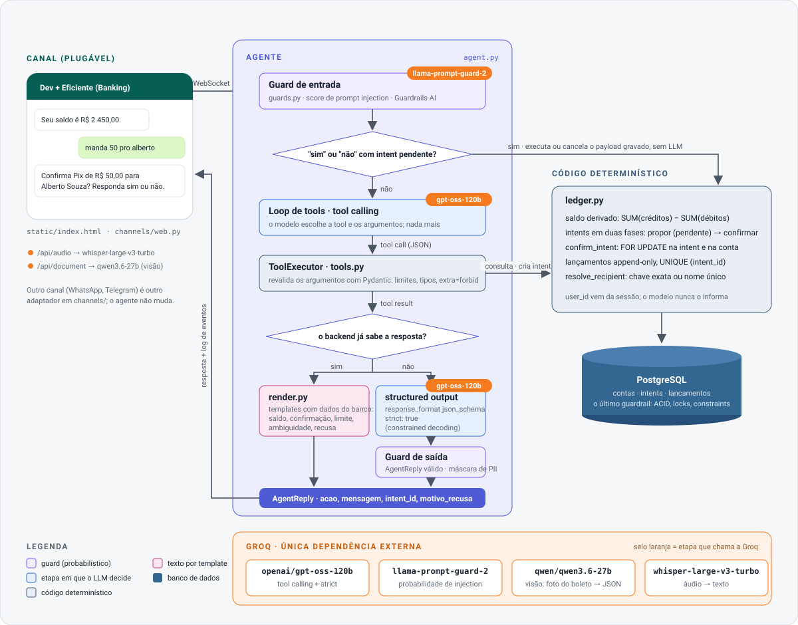

# banking-ai

Um banco que vive dentro de uma conversa. Você escreve "qual meu saldo?" ou "manda 50 pra Maria", um agente de IA entende o pedido, propõe a operação e só executa depois que você responde **sim**.

O projeto simula um core bancário mínimo em PostgreSQL (contas, intenções de transação e um ledger de dupla entrada) e coloca um LLM na frente dele, com uma regra que organiza tudo:

> O LLM nunca toca no dinheiro. Ele só produz intenções estruturadas e validadas. Quem executa é código determinístico. Quem manda é o Postgres.

O que dá para fazer na interface (um front estilo WhatsApp, com um painel ao lado mostrando cada tool call em tempo real):

- consultar saldo e extrato;
- enviar Pix para um contato pelo nome ou pela chave, com confirmação explícita;
- pagar boleto a partir de uma foto, lida por um modelo de visão;
- falar por áudio, transcrito com Whisper;
- ver o agente recusar prompt injection, valores acima do limite e destinatários que não existem.

## Arquitetura



O canal é uma camada trocável: `channels/base.py` define o contrato (`Processor`, `TextMessage`, `DocumentMessage`) e o front web é um adaptador. WhatsApp ou Telegram entrariam como outro arquivo em `channels/`, sem mexer no agente.

## Setup

Você precisa de Docker com Compose e de uma chave da [Groq](https://console.groq.com) (o tier gratuito serve; veja a nota de rate limit no fim desta seção). Nada mais é instalado na máquina: Python, dependências e Postgres vivem nos containers.

```bash
git clone <este repositório> && cd banking-ai
cp .env.example .env          # edite e coloque sua GROQ_API_KEY
docker compose up --build     # Postgres + app
```

Na primeira subida o app aplica `db/schema.sql` e carrega `db/seeds.sql` (usuário Daniel Romero com R$ 2.500,00 e quatro contatos). Depois disso:

- **Front:** http://localhost:8000 (o container escuta em `0.0.0.0`, então de outra máquina na rede é `http://<ip-da-maquina>:8000`).
- **API HTTP:** http://localhost:8000/docs (Swagger) e `/redoc`.
- **Postgres:** `localhost:5433`, usuário, senha e banco `banking`. Para ver o ledger durante uma demo:

  ```bash
  docker compose exec db psql -U banking -d banking -c 'select * from lancamentos order by id desc limit 5'
  ```

- **Voltar ao estado inicial:** botão ⟲ no header do front ou `curl -X POST localhost:8000/api/admin/reset`. Trunca as tabelas, reaplica os seeds e zera as sessões.
- **Parar:** `docker compose down` (os dados ficam no volume `pgdata`; `docker compose down -v` apaga).

Variáveis opcionais no `.env` (defaults em `src/banking_ai/config.py`): `GROQ_MODEL`, `GROQ_VISION_MODEL`, `GROQ_WHISPER_MODEL`, `GROQ_GUARD_MODEL`, `DEMO_USER_PIX_KEY` (troca o usuário logado por outra chave dos seeds), `INJECTION_THRESHOLD`.

Três avisos práticos:

- O botão de microfone só funciona em contexto seguro (HTTPS ou `localhost`). Pelo IP da rede o resto funciona, o áudio não; no Safari há a opção Desenvolvedor → WebRTC → "Permitir captura de mídia em sites não seguros".
- Uma foto de boleto para testar o fluxo de visão está em `demo/boleto-exemplo.png`.
- No tier gratuito da Groq o limite é 8.000 tokens por minuto. Uma conversa normal cabe; mensagens em rajada recebem 429, e o app avisa "espera alguns segundos". Deixe uns 10 s entre mensagens.

Os ícones do front vêm da [Lucide](https://lucide.dev) (licença ISC), vendorizada em `src/banking_ai/static/lucide.min.js`, para a demo funcionar sem internet além da Groq.

## Desenvolvimento

```bash
uv sync
docker compose up -d db
uv run uvicorn banking_ai.app:app --reload
```

Checks (Ruff, Flake8 com as regras anti-slop, mypy strict) e testes:

```bash
uv run ruff check src tests && uv run flake8 src tests && uv run mypy
uv run pytest                                                     # unitários + ledger no Postgres do compose
RUN_INTEGRATION=1 uv run pytest tests/test_integration_groq.py    # conversa completa contra a Groq
```

Os testes de ledger resetam o banco do compose a cada caso. `TEST_DATABASE_URL` aponta para outro Postgres se precisar. Os testes do agente usam um LLM roteirizado (`tests/conftest.py`, `FakeLLM`) em vez de mocks de módulo.

## Como uma mensagem é processada

1. O guard de entrada pede ao Llama Prompt Guard 2 um score de prompt injection e o passa por um validator do Guardrails AI. Acima do limiar, a resposta é uma recusa e o modelo principal nem é chamado.
2. Se existe uma operação pendente e a mensagem é um "sim" ou "não" inequívoco (`agent.interpret_confirmation`), o backend executa ou cancela direto, sem LLM.
3. Caso contrário o modelo recebe o histórico e a lista de tools. Cada tool call que ele devolve é revalidada contra o schema Pydantic antes de tocar no ledger; um erro de validação vira tool result e volta para o modelo.
4. Depois das tools, o backend decide se já sabe a resposta (`Agent._deterministic_reply`): intent criada, saldo, destinatário ambíguo e erro de limite viram texto por template, montado com dados do banco.
5. Só quando não sabe, o modelo é chamado de novo com `response_format` json_schema `strict: true` para produzir `AgentReply`, que passa pelo guard de saída (formato + máscara de PII).
6. Recusas também são padronizadas: o modelo só escolhe `motivo_recusa` (`fora_do_escopo`, `nao_suportado`, `atendimento_humano`, `conta_de_terceiros`, `dado_sensivel`) e `render.refusal_text` escreve a frase. "Quero um empréstimo" e "quero falar com um atendente" recebem sempre a mesma resposta.

Transferências seguem um two-phase commit. Propor grava uma linha em `intents` com o payload validado e status `pendente`. Confirmar (`ledger.confirm_intent`) trava a intent e a conta de origem com `FOR UPDATE`, confere o saldo derivado, insere o lançamento e marca a intent. O que executa é o payload gravado, nunca o que o modelo escreveu na conversa; uma segunda confirmação encontra a intent já confirmada, e o `UNIQUE (intent_id)` em `lancamentos` barra o que escapar do lock.

## As tools do agente

Os schemas estão em `src/banking_ai/models.py`; o registro e a execução em `src/banking_ai/tools.py`. O formato OpenAI (`tools=[...]`) é gerado direto de `model_json_schema()`.

| Tool | Parâmetros | Quando o modelo chama | O que acontece no backend |
|---|---|---|---|
| `consultar_saldo` | nenhum | "qual meu saldo?", "quanto tenho?" | `ledger.get_balance` soma créditos menos débitos. O texto sai por template, sem nova chamada ao modelo. |
| `buscar_contato` | `termo` | "tenho a Maria salva?", "quais contatos eu tenho?" | `ledger.search_contacts` procura por nome (sem acento) ou chave e ignora contas internas. O modelo responde em prosa com a lista. |
| `enviar_pix` | `destinatario`, `valor_centavos`, `descricao` | "manda 50 pro Alberto", "faz um Pix de 200 pra maria@email.com" | `ledger.resolve_recipient` escolhe a conta: chave exata ou nome com um único match. Dois candidatos ou nenhum viram uma pergunta por template. Com a conta resolvida, `ledger.create_intent` grava a intenção e o sistema pede o "sim". |
| `pagar_boleto` | `linha_digitavel`, `valor_centavos`, `beneficiario` | quando o documento anexado está incompleto e o modelo precisa pedir o que falta | `ledger.create_intent` grava a intenção do tipo `boleto`; o pagamento credita uma conta interna "Boletos". Um boleto completo (linha, valor e beneficiário lidos pela visão) nem passa pelo modelo: `Agent._boleto_turn` valida contra o mesmo schema e propõe direto. |

Regras que valem para todas:

- `user_id` nunca é parâmetro. Vem da sessão; o modelo não escolhe em nome de quem age. Os models usam `extra="forbid"`, então um campo inventado falha na validação.
- Limites vivem no schema: `SendPix.valor_centavos` tem `le=500_000` (R$ 5.000,00). "Manda 1 milhão" vira uma tool call rejeitada pelo Pydantic e uma mensagem de limite por template.
- Valores são sempre centavos inteiros. Converter "50" em `5000` é o único número que o modelo produz; a confirmação por template ("Confirma Pix de R$ 50,00 para Alberto Souza?") é o check humano contra uma conversão errada.
- Não existe tool de executar ou cancelar. `confirm_intent` e `cancel_intent` são funções do ledger chamadas pelo backend quando o usuário responde; se o modelo tentar chamar uma delas, recebe `ferramenta_desconhecida`.

## Guardrails em camadas

| Risco | Onde barra |
|---|---|
| Inventar saldo ou valor | Regra 1 do system prompt; saldo sai por template a partir do tool result |
| R$ 50 virar R$ 0,50 | `valor_centavos: int` no schema + confirmação por template |
| Ultrapassar limite | `Field(le=...)` em `SendPix` e `PayBoleto` |
| Adivinhar destinatário | `ledger.resolve_recipient` escolhe a chave; ambiguidade vira pergunta com candidatos reais |
| Executar sem autorização | não há tool de execução; o "sim" é interpretado de forma determinística e executado pelo backend |
| Repetir valores errados na confirmação | `render.confirmation_text` usa a intent gravada, nunca a prosa do modelo |
| Requisição duplicada | `FOR UPDATE` na intent + `UNIQUE (intent_id)` no ledger |
| Prompt injection (mensagem ou documento) | score do Prompt Guard num validator do Guardrails; texto de documento entra demarcado como dado |
| JSON fora do schema | `strict: true` na Groq; reask do Guardrails como rede |
| PII na resposta | validator `NoPII` mascara CPF, CNPJ e cartão |
| Texto de recusa variando a cada execução | `motivo_recusa` no schema strict + `render.refusal_text` |
| Modelo "inventar" uma tool (`recusar`, `confirmar_intent`) | `ToolError(ferramenta_desconhecida)` orienta a usar `acao` e encerra a rodada |

Guardrails AI cobre a camada probabilística (formato, injection, PII). As garantias financeiras são Pydantic, código determinístico e Postgres.

## Estado inicial (seeds)

Na subida, `db.prepare_database` aplica `db/schema.sql` (idempotente, tudo `IF NOT EXISTS`) e roda `db/seeds.sql` só se a tabela `contas` estiver vazia. O botão **⟲ reset** no front, ou `POST /api/admin/reset`, trunca as três tabelas, reaplica os seeds e apaga as sessões em memória, então dá para voltar ao estado inicial de qualquer ponto de uma conversa.

| Conta | Chave Pix | Saldo inicial | Papel |
|---|---|---|---|
| Daniel Romero | `daniel@email.com` | R$ 2.500,00 | usuário logado na demo (`DEMO_USER_PIX_KEY`) |
| Alberto Souza | `+5511999990001` | R$ 300,00 | um dos dois Albertos |
| Alberto Pereira | `alberto.pereira@email.com` | R$ 120,00 | o outro Alberto, para forçar a desambiguação |
| Maria Oliveira | `11122233344` | R$ 1.000,00 | chave tipo CPF (o guard de PII mascara se o modelo tentar escrevê-la) |
| Carlos Lima | `+5521988887777` | R$ 50,00 | contato comum |
| Tesouraria | `tesouraria@banco.demo` | negativa | conta interna que "emite" os saldos iniciais |
| Boletos | `boletos@banco.demo` | zero | conta interna creditada por pagamentos de boleto |

Não existe coluna de saldo. Os saldos iniciais são lançamentos da Tesouraria para cada conta, com `intent_id` nulo (o `UNIQUE (intent_id)` admite vários nulos, então aportes não colidem entre si). Contas com chave terminada em `@banco.demo` são internas: `ledger.search_contacts` e `ledger.resolve_recipient` as ignoram, e ninguém consegue mandar Pix para elas. Para trocar o usuário da demo, aponte `DEMO_USER_PIX_KEY` para outra chave dos seeds.

## Exemplos de chamadas

A documentação interativa da API HTTP fica em `/docs`. Alguns exemplos com `curl`:

```bash
# quem é o usuário da sessão e qual modelo está em uso
curl -s localhost:8000/api/session
# {"user":"Daniel Romero","pix_key":"daniel@email.com","model":"openai/gpt-oss-120b"}

# saldo derivado e últimos lançamentos
curl -s localhost:8000/api/statement
# {"user":"Daniel Romero","balance_cents":250000,"entries":[{"id":1,"intent_id":null,"direction":"credit","counterparty":"Tesouraria","amount_cents":250000,"created_at":"..."}]}

# ler um boleto com o modelo de visão (não paga nada; só extrai os dados)
curl -s -F "file=@demo/boleto-exemplo.png" localhost:8000/api/document
# {"document":{"tipo":"boleto","linha_digitavel":"23793381286000000000300000000400184340000015000","chave_pix":null,"valor_centavos":15000,"beneficiario":"ENERGIA LUZ S.A.","vencimento":"30/08/2026"}}

# transcrever um áudio (webm, wav, m4a...); devolve {"text": "<o que o Whisper entendeu>"}
curl -s -F "file=@gravacao.webm" localhost:8000/api/audio

# simular uma requisição duplicada: reexecutar a confirmação de uma intent já executada
curl -s -X POST localhost:8000/api/intents/<intent_id>/resend-confirmation
# {"result":{"status":"ja_executada",...},"message":"Essa transferência de R$ 50,00 para Alberto Souza já tinha sido executada; nada foi enviado de novo.","events":[...]}

# voltar ao estado inicial
curl -s -X POST localhost:8000/api/admin/reset
# {"ok":true,"user":"Daniel Romero"}
```

A conversa em si passa pelo WebSocket `/ws/{session_id}`. O cliente envia `TextMessage` ou `DocumentMessage` (`channels/base.py`) e recebe uma sequência de quadros `event` (o mesmo log que o painel mostra) encerrada por um quadro `reply`:

```python
import asyncio, json
from websockets.asyncio.client import connect

async def ask(text: str) -> None:
    async with connect("ws://localhost:8000/ws/example") as ws:
        await ws.send(json.dumps({"kind": "text", "text": text}))
        while True:
            frame = json.loads(await ws.recv())
            if frame["kind"] == "reply":
                print(frame["reply"])
                return
            print(frame["event"]["kind"], "|", frame["event"]["title"])

asyncio.run(ask("manda 50 pro alberto"))
```

Saída de uma execução real desse exemplo:

```
typing       | digitando
user_message | mensagem do usuário
input_guard  | guard de entrada · injection score 0.000
llm          | LLM · openai/gpt-oss-120b · tool calling (rodada 1)
tool_call    | tool call · enviar_pix
tool_result  | tool result · enviar_pix
template     | resposta por template (dados do banco)
reply        | resposta · acao=pedir_esclarecimento
{'acao': 'pedir_esclarecimento', 'mensagem': 'Encontrei 2 contatos para “Alberto”:\n1) Alberto Pereira (chave alb…om)\n2) Alberto Souza (chave +55…01)\nQual deles?', 'intent_id': None}
```

Mandando na mesma sessão `"o Alberto Souza"` vem `acao=pedir_confirmacao` com o `intent_id` da intent pendente e a mensagem montada por template; um `"sim"` em seguida executa sem passar pelo modelo e responde `"Feito! R$ 50,00 enviados para Alberto Souza. Seu saldo agora é R$ 2.450,00."`. O quadro de resposta tem sempre o formato de `AgentReply`: `acao` (`responder`, `pedir_confirmacao`, `pedir_esclarecimento` ou `recusar`), `mensagem`, `intent_id` e `motivo_recusa`.

Para anexar um documento pelo WebSocket, envie o JSON que `/api/document` devolveu: `{"kind": "document", "document": {...}}`. O agente o embrulha em `<documento>...</documento>` e o trata como dado, nunca como instrução.

## Convenção de nomes

Identificadores de código em inglês: módulos, classes, funções, variáveis, testes, eventos do log, quadros do WebSocket, rotas e campos da API HTTP, JavaScript e CSS do front.

Português, de propósito, em três lugares:

- tudo que o usuário lê: interface, templates de `render.py`, mensagens de erro e o system prompt;
- o vocabulário que o modelo manipula: nomes das tools (`enviar_pix`), seus campos (`destinatario`, `valor_centavos`), os campos dos tool results e de `AgentReply` (`acao`, `mensagem`) e os valores de `acao`. O schema das tools é parte do prompt, e o painel projeta esse JSON para uma plateia que conversa em português;
- substantivos do domínio sem tradução limpa e as colunas do banco: `pix`, `boleto`, `intent`, `linha_digitavel`, `chave_pix`, `contas`, `lancamentos`.

Assim `SendPix.destinatario`, `ledger.confirm_intent` e `LogEvent(kind="tool_call", title="tool call · enviar_pix")` convivem sem parecer tradução literal.
